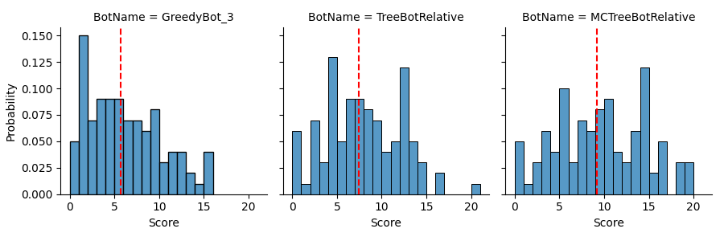

Rainworms
=========

This repository contains a simple, self playing implementation of *Rainworms*.

*RainWorms* is a relatively simple game, where the player rolls the dice and then selects the dice they want to keep. They then roll again until they can either select a stone with a corresponding value or they can't and have to give the top stone back to the bank. The most valuable stone in the bank is flipped when a player loses a turn. This continues until all stones are gone or flipped.

This implementation is made so that it can be played interactively, or easily played by custom bots. 

You can play Rainworms yourself by running the `rainworms.py` script with a recent version of Python 3. Alternatively, you can let the computer play this game.

Bots
----

5 Bots have been implemented, with some being minor variations on each.

__GreedyBot__ - When rolling the dice, this bot will always select the set of dice with the highest value. This means that it will generally take a good selection, but will for example prefer 3 * 4 over 2 * 5. Worms are rated higher than 5, even though they have the same points value. It will always pick the highest valued stone.

__GreedyStealingBot__ - Functions the same as GreedyBot, but it values stealing from another player higher than taking the best stone. In effect this is a worse bot, because it is more constrained in its actions.

__TreeBot__ - This bot is more advanced. It will create a number of simulations of the game it is currently in and play these out until the player loses in the simulation or takes a stone. At each point that the player can take an action in the simulation, the simulation will split into separate sub-simulations. This ultimately results in a complete mapping of the game space from that turn. It then selects the action that is most likely to give it the best stone.

This is exceedling inefficient, and while GreedyBot can happily play hundreds of games per second, TreeBot will take ~100 seconds to finish a game. It does perform better than GreedyBot in the long run.

__RelativeTreeBot__ - This is TreeBot, except that the scoring system is adjusted such that the highest stone is no longer valued. Instead, scoring is based on the relative score the bot will have at the end compared to the other players. This bot will generally play better than TreeBot, as it is rewarded for stealing stones.

__MCRelativeTreeBot__ - RelativeTreeBot, but way more efficient. Instead of simulating every single possible action, only a single random action is selected (Monte Carlo) from all the possible actions. This makes the simulation size linear as opposed to exponential. Generally this bot will finish a game in less than 10 seconds. With the proper scoring technique, it will also perform noticably better than TreeBotRelative.

You can let the bots play this game by running the `run_game_automated.py` script with a recent version of Python 3. When the specified number of games is complete, an overview of the statistics will be generated.

```
100%|██████████| 100/100 [2:19:40<00:00, 83.80s/it]
Played 100 in 8380.041s, 0.0 games per second.
                   mean       std
GreedyBot_3        5.72  4.148944
TreeBotRelative    7.44  4.283678
MCTreeBotRelative  9.16  5.004483

Process finished with exit code 0
```

